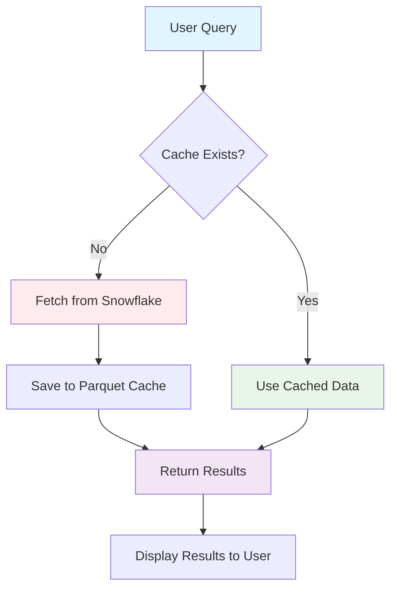
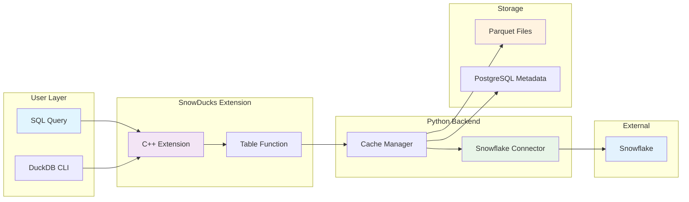
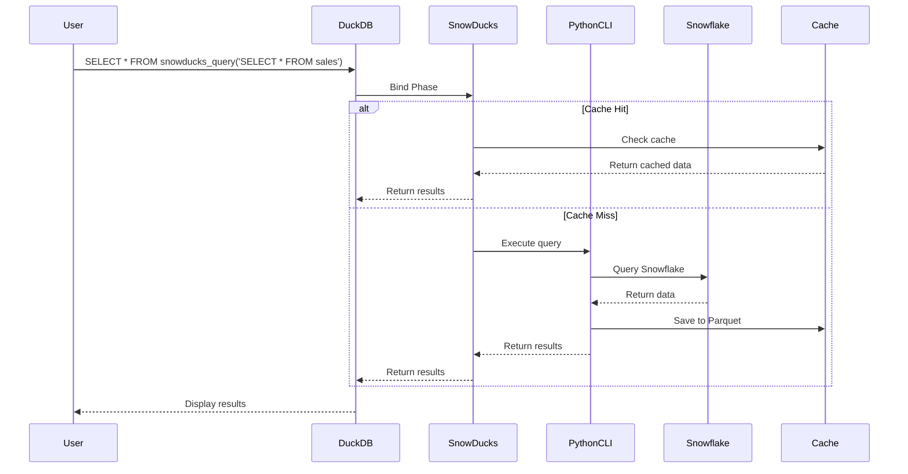
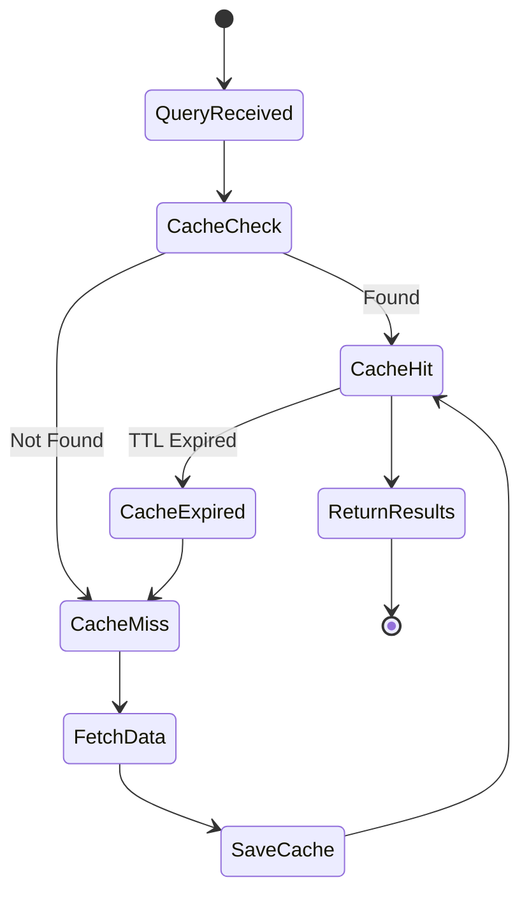
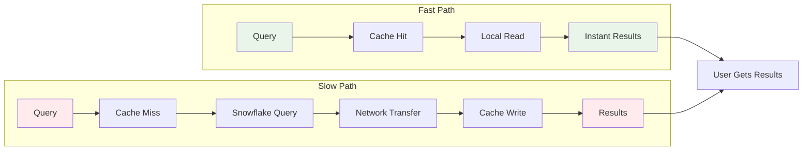

# SnowDucks Workflow Diagram

## Complete Data Flow

```mermaid
flowchart TD
    A[User Query] --> B{Cache Exists?}
    B -->|No| C[Fetch from Snowflake]
    B -->|Yes| D[Use Cached Data]
    
    C --> E[Save to Parquet Cache]
    E --> F[Return Results]
    D --> F
    
    F --> G[Display Results to User]
    
    style A fill:#e1f5fe
    style C fill:#ffebee
    style D fill:#e8f5e8
    style F fill:#f3e5f5
```

## Component Architecture

```mermaid
flowchart LR
    subgraph "User Layer"
        A[SQL Query]
        B[DuckDB CLI]
    end
    
    subgraph "SnowDucks Extension"
        C[C++ Extension]
        D[Table Function]
    end
    
    subgraph "Python Backend"
        E[Snowflake Connector]
        F[Cache Manager]
    end
    
    subgraph "Storage"
        G[Parquet Files]
        H[PostgreSQL Metadata]
    end
    
    subgraph "External"
        I[Snowflake]
    end
    
    A --> C
    B --> C
    C --> D
    D --> F
    F --> E
    E --> I
    F --> G
    F --> H
    
    style A fill:#e1f5fe
    style C fill:#f3e5f5
    style E fill:#e8f5e8
    style G fill:#fff3e0
    style I fill:#e3f2fd
```

## Query Execution Flow

```mermaid
sequenceDiagram
    participant User
    participant DuckDB
    participant SnowDucks
    participant PythonCLI
    participant Snowflake
    participant Cache
    
    User->>DuckDB: SELECT * FROM snowducks_query('SELECT * FROM sales')
    DuckDB->>SnowDucks: Bind Phase
    
    alt Cache Hit
        SnowDucks->>Cache: Check cache
        Cache-->>SnowDucks: Return cached data
        SnowDucks-->>DuckDB: Return results
    else Cache Miss
        SnowDucks->>PythonCLI: Execute query
        PythonCLI->>Snowflake: Query Snowflake
        Snowflake-->>PythonCLI: Return data
        PythonCLI->>Cache: Save to Parquet
        PythonCLI-->>SnowDucks: Return results
        SnowDucks-->>DuckDB: Return results
    end
    
    DuckDB-->>User: Display results
```

## Cache Lifecycle

```mermaid
stateDiagram-v2
    [*] --> QueryReceived
    QueryReceived --> CacheCheck
    CacheCheck --> CacheHit : Found
    CacheCheck --> CacheMiss : Not Found
    CacheMiss --> FetchData
    FetchData --> SaveCache
    SaveCache --> CacheHit
    CacheHit --> ReturnResults
    ReturnResults --> [*]
    
    CacheHit --> CacheExpired : TTL Expired
    CacheExpired --> CacheMiss
```

## Performance Comparison

```mermaid
flowchart LR
    subgraph "Fast Path"
        A1[Query] --> A2[Cache Hit]
        A2 --> A3[Local Read]
        A3 --> A4[Instant Results]
    end
    
    subgraph "Slow Path"
        B1[Query] --> B2[Cache Miss]
        B2 --> B3[Snowflake Query]
        B3 --> B4[Network Transfer]
        B4 --> B5[Cache Write]
        B5 --> B6[Results]
    end
    
    A4 --> C[User Gets Results]
    B6 --> C
    
    style A1 fill:#e8f5e8
    style A4 fill:#e8f5e8
    style B1 fill:#ffebee
    style B6 fill:#ffebee
``` 